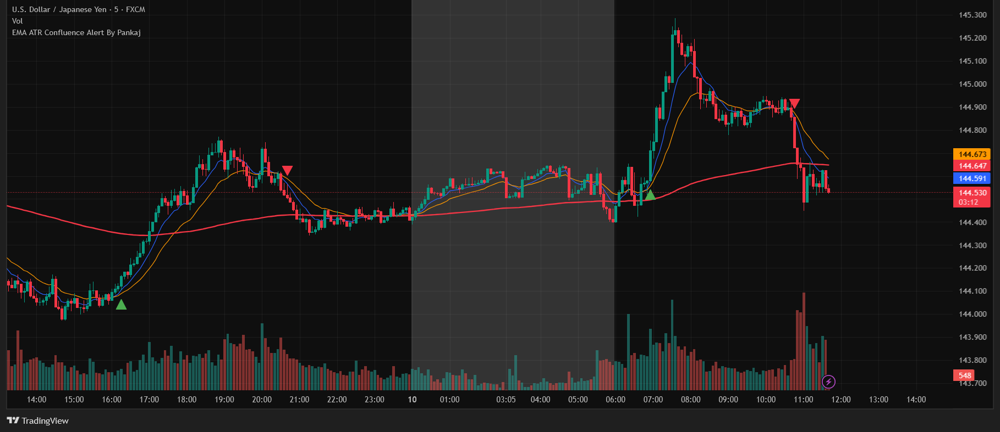

# EMA ATR Confluence Alert By Pankaj (TradingView Indicator)

## Purpose
This Pine Script indicator for TradingView is designed to identify potential trade entries on the **USDJPY** currency pair. It operates exclusively on **5-minute and 15-minute** chart timeframes. The core logic relies on EMA (Exponential Moving Average) crossovers, confirmed by an ATR (Average True Range) based gap, and occurring within specific active trading hours (Indian Standard Time).

The primary goal is to help filter market noise and identify setups with a confluence of favorable conditions, thereby potentially reducing the risk of entering fake trades.

## How it Works

1.  **Symbol & Timeframe Specificity**:
    *   **Symbol**: Exclusively for USDJPY.
    *   **Timeframes**: Only active and plotting on 5-minute and 15-minute charts. On other timeframes, it will not display or generate signals.

2.  **Trading Hours (IST - Indian Standard Time)**:
    *   **Active Session**: The indicator generates signals and plots EMAs only from **06:00 AM IST to 12:00 AM (midnight) IST**.
    *   **Dead Period**: The hours from **00:00 AM IST to 05:59 AM IST** are considered a "Dead Period." 
        *   During this dead period, the chart background (for USDJPY on allowed timeframes) is shaded with a semi-transparent white color.
        *   No EMAs are plotted, and no trade signals or alerts are generated.

3.  **Core Signal Logic**:
    *   **EMAs**: Uses three EMAs:
        *   9-period EMA (Fast)
        *   20-period EMA (Slow)
        *   200-period EMA (Trend context)
    *   **Crossover**: It looks for a crossover of the 9 EMA above the 20 EMA (for a long signal potential) or the 9 EMA below the 20 EMA (for a short signal potential).
    *   **ATR Gap Confirmation**: After a crossover is detected, the indicator waits for the absolute difference (gap) between the 9 EMA and 20 EMA to become greater than a minimum threshold. This threshold is dynamically calculated as:
        `ATR(14) * atrMultiplier (default 0.25)`.
    *   **Signal Window**: A signal is considered valid if the ATR gap confirmation occurs on the crossover bar itself OR within the next `maxBarsAfterCross` bars (default is 3 bars). This means a signal can appear on the crossover bar or up to 3 candles after it, providing a 4-candle window for the setup to mature.
    *   **200 EMA Context**: The 200 EMA is plotted during active sessions to provide a general sense of the longer-term trend. Alerts generated by the indicator also include the percentage distance of the closing price from this 200 EMA at the time of the signal.

4.  **Visuals & Alerts**:
    *   **EMAs**: Blue (9 EMA), Orange (20 EMA), Red (200 EMA) - plotted only during active sessions.
    *   **Long Signal**: Green upward-pointing triangle below the price bar.
    *   **Short Signal**: Red downward-pointing triangle above the price bar.
    *   **Dead Period Highlight**: Semi-transparent white background shading.
    *   **Alerts**: Can be configured to notify on `LONG` or `SHORT` signals.

## How to Use in TradingView

1.  **Open Chart**: Open TradingView and navigate to the USDJPY chart. Ensure your chart timeframe is set to either 5 minutes or 15 minutes.
2.  **Open Pine Editor**: At the bottom of your TradingView chart screen, click on the "Pine Editor" tab.
3.  **Copy Code**: Copy the entire Pine Script code provided for this indicator (`indicator.pine`).
4.  **Paste Code**: In the Pine Editor, delete any existing template code and paste the copied indicator code.
5.  **Add to Chart**: Click the "Add to Chart" button located above the Pine Editor. The indicator should now appear on your USDJPY chart (if on a 5/15 min timeframe).

## How to Create Alerts

1.  **Access Alert Panel**: With the "EMA ATR Confluence Alert By Pankaj" indicator active on your chart:
    *   Click the "Alert" icon (looks like an alarm clock) in the right-hand toolbar of TradingView.
    *   Alternatively, right-click directly on one of the indicator's plots (like an EMA line or a signal arrow) and select "Add Alert on EMA ATR Confluence Alert By Pankaj".
2.  **Configure Alert**:
    *   **Condition**: Select "EMA ATR Confluence Alert By Pankaj" as the source. The specific alert condition to choose will be "EMA Signal Alert".
    *   **Options**: Choose how often the alert should trigger (e.g., "Once per bar close" is recommended for confirmed signals, or "Once per bar" for earlier notification).
    *   **Expiration time**: Set as needed.
    *   **Alert Actions**: Choose how you want to be notified (e.g., "Notify on app," "Show pop-up," "Send email," "Webhook URL").
    *   **Message**: The default message includes `{{strategy.order.action}}` (which will be LONG or SHORT based on the signal), `{{syminfo.ticker}}`, and the percentage distance from the 200 EMA: `EMA Signal Generated - Distance from 200 EMA: {{percentageDistance}}`. You can customize this further if needed.
3.  **Create**: Click the "Create" button.

    **Note on Subscriptions**: TradingView's free plan may offer a limited number of server-side alerts (e.g., one at a time). To set multiple, persistent alerts that run 24/7, you will likely need a paid TradingView subscription (e.g., Pro, Pro+, or Premium). Please check their current subscription plans for details on alert limits.

## ⚠️ Important Warning ⚠️

*   This indicator is **NOT a standalone buy/sell signal generator**.
*   It is a tool designed to help filter market conditions and identify potential setups based on a specific confluence of events. It aims to reduce noise but does not guarantee profitable trades.
*   **ALWAYS** use this indicator in conjunction with your comprehensive trading strategy, robust risk management rules, and other forms of market analysis (e.g., price action, market structure, support/resistance, other indicators, fundamental analysis).
*   Trading financial markets involves significant risk. Past performance of any trading system or methodology is not indicative of future results. **Trade responsibly.**

## Configurable Inputs

*   **EMA 9 Length**: Default 9
*   **EMA 20 Length**: Default 20
*   **EMA 200 Length**: Default 200
*   **EMA Source**: Default `close`
*   **ATR Period**: Default 14
*   **ATR Multiplier**: Default 0.25 (for gap calculation)
*   **Max Bars to Wait After Cross**: Default 3 (signal window)
*   **Dead Period Start Hour (IST)**: Default 0 (00:00 IST)
*   **Dead Period Start Minute (IST)**: Default 0
*   **Dead Period End Hour (IST)**: Default 6 (06:00 IST)
*   **Dead Period End Minute (IST)**: Default 0
